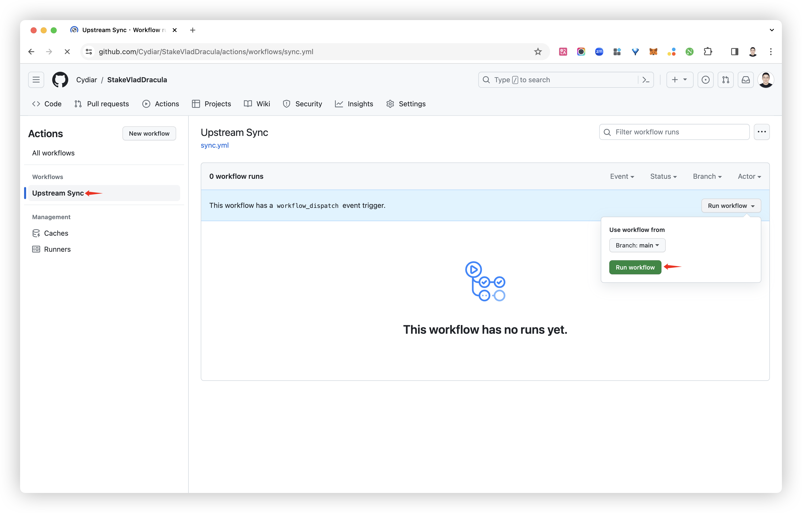

# How to keep the forked code up to date

## Automatic update
> If you encounter an Upstream Sync execution error, please manually Sync Fork once!

After you fork the project, due to Github's restrictions, you need to manually go to the Actions page of your forked project to enable Workflows and enable Upstream Sync Action. After enabling it, you can start automatic daily scheduled updates.

1. Click to enter Action Tab  
2. Click on the green. “I understand my workflows, go ahead and enable them” Button, enable Workflows  
3. Click Upstream Sync Enable workflow Button, enable Upstream Sync Action

After enabling, the project you fork will automatically update the code daily at 00:00 UTC.

## Manually update code
If you want to manually update immediately, you can check. [Documentation of Github](https://docs.github.com/en/pull-requests/collaborating-with-pull-requests/working-with-forks/syncing-a-fork) Learn how to synchronize the forked project with the upstream code.

You can star/watch this project or follow the author to receive timely notifications of new feature updates.
